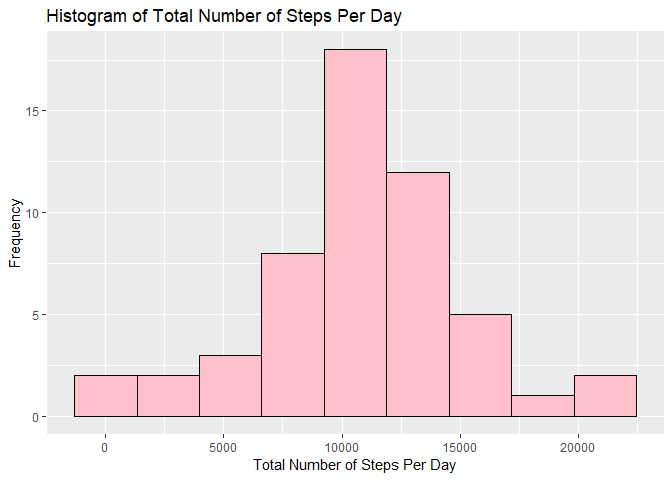
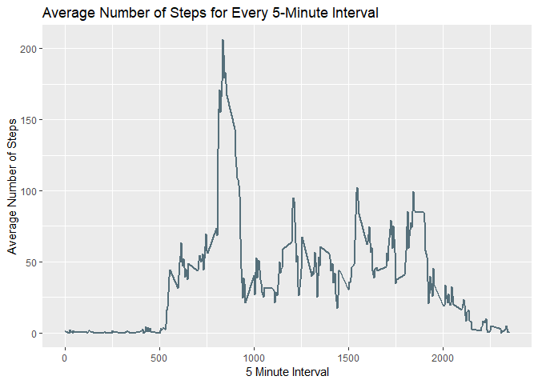
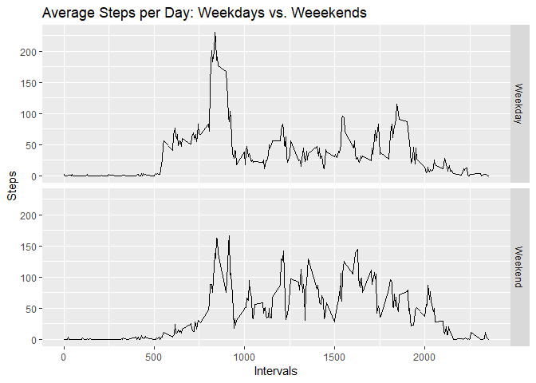

## Loading and preprocessing the data

**1. Load the data**


```r
masterdata<-read.csv("activity.csv")
```

**2. Process/transform the data into a format suitable for analysis**


```r
masterdata$date<-as.Date(masterdata$date, "%Y-%m-%d")
```

The date column in the masterdata data frame is transformed from class **factor** to class **date** using the `as.Date()` function. 


## What is mean total number of steps taken per day?

**1. Calculate the total number of steps taken per day**

The total number of steps per day is calculated by using the functions `aggregate()` and `sum()`. 


```r
sumperday<-aggregate(steps~date,data=masterdata,sum)
```


**2. Make a histogram of the total number of steps taken each day**

Using the total number of steps taken each day stored in *sumperday*, a histogram is made using the `ggplot()` function of  [ggplot2](https://cran.r-project.org/web/packages/ggplot2/index.html) package. 


```r
library(ggplot2)
p<-ggplot(sumperday, aes(x=steps)) + geom_histogram(color="black", fill="pink",bins=9)+labs(title="Histogram of Total Number of Steps Per Day",x="Total Number of Steps Per Day",y="Frequency")
p
```

<!-- -->

**3. Calculate and report the mean and median of the total number of steps taken per day**

The mean and median are obtained using the `mean()` and `median()` functions, respectively.


```r
mean(sumperday$steps)
```

```
## [1] 10766.19
```

```r
median(sumperday$steps)
```

```
## [1] 10765
```


## What is the average daily activity pattern?

**1. Make a time series plot of the 5-minute interval (x-axis) and the average number of steps taken, averaged across all days (y-axis).**

The average per interval is first calculated using the `aggregate()` and `mean()` function, stored in the variable *meanperint*. For plotting, the `ggplot()` function is used along with the `geom_line()` function.


```r
meanperint<-aggregate(steps~interval,data=masterdata,mean)
g<-ggplot(meanperint,aes(x=interval,y=steps,group=1))
g+geom_line(size=1,color="#556F7A")+labs(title="Average Number of Steps for Every 5-Minute Interval",y="Average Number of Steps",x="5 Minute Interval")
```

<!-- -->


**2. Which 5-minute interval, on average across all the days in the dataset, contains the maximum number of steps?**

The maximum average of number of steps and its corresponding interval is obtained by using the `which.max()` function on the *meanperint* data frame and subsetting the obtained index from the same data frame.


```r
meanperint[which.max(meanperint$steps),]
```

```
##     interval    steps
## 104      835 206.1698
```


## Imputing missing values

**1. Calculate and report the total number of missing values in the dataset**

The number of NA values in the dataset is obtained by using the `is.na()` function and adding up all the TRUE values (in this case, NA values) using `sum()` function.


```r
sum(is.na(masterdata$steps))
```

```
## [1] 2304
```

**2. Devise a strategy for filling in all of the missing values in the dataset. The strategy does not need to be sophisticated. For example, you could use the mean/median for that day, or the mean for that 5-minute interval, etc.**

The strategy implemented is substituting the NA values with the average number of steps obtained from the previous steps, stored in the *meanperint* variable. The initial part of the strategy is merging the two datasets, *masterdata* and *meanperint*, with the *interval* column as the joining column, with all **left** values (masterdata) set to TRUE. This merged data frame is stored in the **merged** data frame. The columns of the **merged** data frame are as follows:

- **interval**: identifier for the 5-minute interval in which measurement was taken

- **steps.x**: number of steps taking in a 5-minute interval, with missing values as NA

- **date**: date on which the measurement was taken in YYYY-MM-DD format

- **steps.y**: the average number of steps in the 5-minute interval, obtained from *meanperint*


```r
merged<-merge(masterdata,meanperint,by="interval",all.x=TRUE)
names(merged)
```

```
## [1] "interval" "steps.x"  "date"     "steps.y"
```

The next part is using a for loop in identifying and replacing the NA values with the interval values. Using the `which()` and `is.na()` functions, the indices of the NA values in the **merged** data frame is obtained, and they are then replaced with the expression inside the for loop, as seen below.


```r
for (i in which(is.na(merged$steps.x)))
        {merged$steps.x[i]<-merged$steps.y[i]}
```


**3. Create a new dataset that is equal to the original dataset but with the missing data filled in.**

The new dataset called *masterdata1* is obtained by subsetting the *merged* data frame, and getting only the *date*, *interval*, and *steps.x* column (previously, steps, now called steps.x because of the merging). To check, the `sum()` and `is.na()` functions are used to count the number of NA values, with expected value equal to 0. 


```r
masterdata1<-merged[,c(1,2,3)]
sum(is.na(masterdata1$steps))
```

```
## [1] 0
```

**4. Make a histogram of the total number of steps taken each day**

The total steps taken each day is obtained using the `aggregate()` and `sum()` functions, stored in the *sumperday2*.


```r
sumperday2<-aggregate(steps.x~date,data=masterdata1,sum)
```

Using the total number of steps taken each day stored in *sumperday2*, a histogram is made using the `ggplot()` function of  [ggplot2](https://cran.r-project.org/web/packages/ggplot2/index.html) package. 


```r
q<-ggplot(sumperday2, aes(x=steps.x)) + geom_histogram(color="black", fill="pink",bins=9)+labs(title="Histogram of Total Number of Steps Per Day",x="Total Number of Steps Per Day",y="Frequency")
q
```

<!-- -->

**5. Calculate and report the mean and median total number of steps taken per day. **

The mean and median are obtained using the `mean()` and `median()` functions, respectively.


```r
mean(sumperday2$steps)
```

```
## [1] 10766.19
```

```r
median(sumperday2$steps)
```

```
## [1] 10766.19
```

**6. Do these values differ from the estimates from the first part of the assignment? What is the impact of imputing missing data on the estimates of the total daily number of steps?**

***Without imputing NAs: ***


```r
mean(sumperday$steps)
```

```
## [1] 10766.19
```

```r
median(sumperday$steps)
```

```
## [1] 10765
```

***Imputing NAs with average: ***


```r
mean(sumperday2$steps)
```

```
## [1] 10766.19
```

```r
median(sumperday2$steps)
```

```
## [1] 10766.19
```

When missing values are imputed in the given dataset, the mean and median are equal.


## Are there differences in activity patterns between weekdays and weekends?


The days of the week of the dates are obtained using the `weekdays()` function. This is only valid if the date is in class **date**, which we already transformed in the initial preprocessing. They are stored in a new column in the *masterdata1* data frame called *day*.


```r
masterdata1$day<-weekdays(masterdata1$date)
```

They days are then classified into *Weekend* and *Weekday* using the `ifelse()` function. The *day* column is then subsetted out of the masterdata, leaving only the Weekend and Weekday classification (*daytype* column).


```r
masterdata1$daytype<-ifelse(masterdata1$day=="Saturday" | masterdata1$day=="Sunday", "Weekend", "Weekday")
masterdata1<-masterdata1[,c(1,2,3,5)]
```

The average number of steps taken per day for each day type and interval is then obtained using the `aggregate()` and `mean()` function. These are stored in the data frame *wkday*.


```r
wkday<-aggregate(steps.x~interval+daytype,data=masterdata1,mean)
```

The values stored in the *wkday* data frame are then plotted, using the `ggplot()` function of the package [ggplot2](https://cran.r-project.org/web/packages/ggplot2/index.html), along with the `geom_line()` and `facet_grid()` functions.


```r
library(ggplot2)
r <- ggplot(wkday, aes(interval,steps.x)) + geom_line()
r + facet_grid(rows = vars(daytype)) + labs(y="Steps",x="Intervals",title="Average Steps per Day: Weekdays vs. Weeekends")
```

<!-- -->

During weekdays, the data peaks are generated at an earlier interval, and at a higher peak especially at around interval 800. During weekends, the peaks are almost similar to its first peak, but the peaks are lower than the single peak during weekday.

